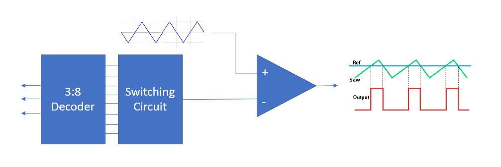
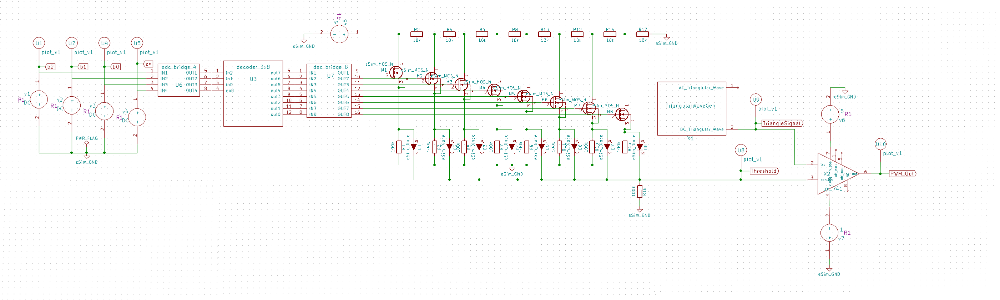
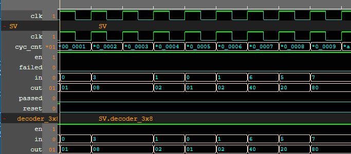
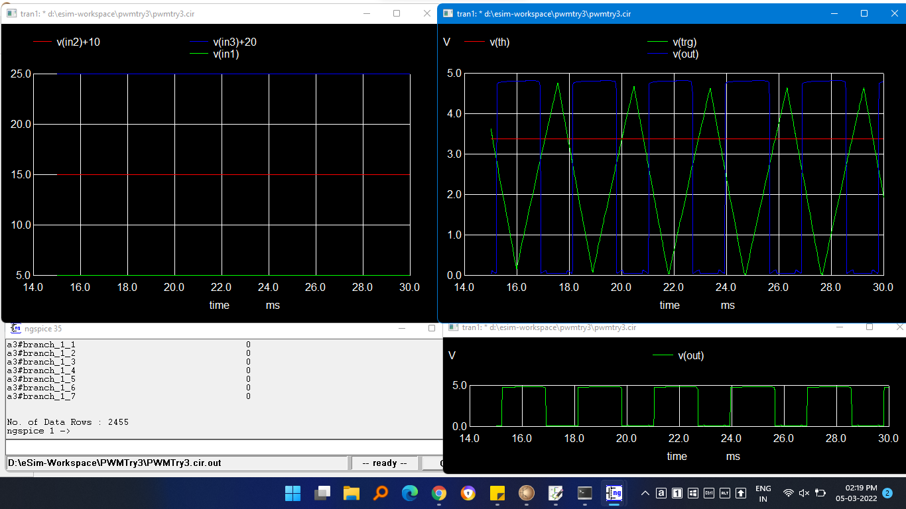
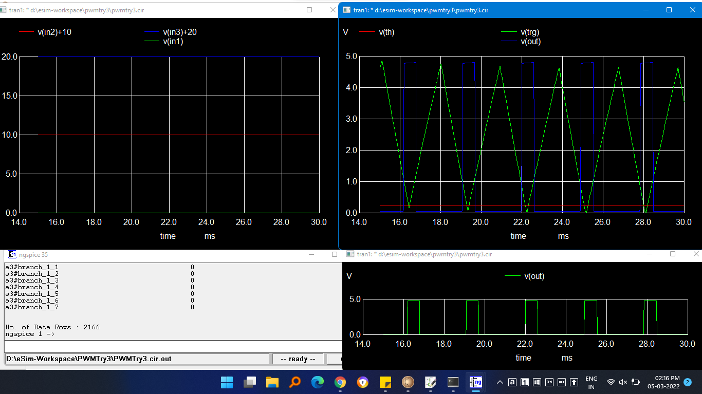

# 3bit-PWM-Generator-using-eSim
#### 3bit digitally controlled PWM Generator using eSim, using ngveri(Makerchip) and ngspice tools.

## Table of Contents

* [Abstract](#Abstract)
* [Reference Circuit Diagram](#Reference-Circuit-Diagram)
* [Reference Circuit Waveform](#Reference-Circuit-Waveform)
* [Circuit Details](#Circuit-Details)
* [Tools Used](#Tools-Used)
	* [eSim](#eSim)
	* [NgSpice](#NgSpice)
	* [Makerchip](#Makerchip)
	* [Verilator](#Verilator)
* [Project Files](#Project-Files)
    * [Schematic](#Schematic)
    * [Verilog Code](#Verilog-Code)
    * [Makerchip](#Makerchip)
    * [Makerchip Waveform](#Makerchip-Waveform)
    * [Netlist](#Netlist)
    * [NgSpice Plot](#NgSpice-Plot)
* [Steps to run NgVeri Model](#Steps-to-run-NgVeri-Model)
* [Steps to run this project](#Steps-to-run-this-project)
* [Conclusion](#Conclusion)
* [Author](#Author)
* [Acknowledgement](#Acknowledgement)
* [References](#References)

## Abstract

Pulse Width Modulation(PWM) is a method of reducing the average power delivered by an electrical signal by effectively chopping it up into discrete parts. My design for digitally controlled PWM generator, I’ll use components like decoder, MOSFETs, and OpAmps in combination with a circuit to generate a triangular wave to compare with, which in turn give PWM. Since, the input is 3bit, there is 8 possible combination of input which will give 8 possible outputs. The 3bit input is given to decoder which given corresponding decimal form output which passes the value to a comparator which produces the expected PWM.

## Reference Circuit Diagram

<p align="center">
	
	</br>
	Figure 1 : Reference Circuit
</p>

## Reference Circuit Waveform

| Input | Output |
|:-----:|:------:|
|		|		|
|		|		|

## Circuit Details

The input to circuit is in 3bit binary, which then processed through decoder which inturn switches an array of Mosfets. The drain of mosfet are connected to ends of voltage divider. The combination of decoder and mosfet makes it function as DAC. The output value of mosfet circuit is passed at non-inverting terminal of Op-Amp. The inverting terminal is connected to triangular signal. The output of Op-Amp is resultant PWM we're looking for.

## Tools Used

### eSim
<p align="center">
	
	</br>
	Figure 1 : Reference Circuit
</p>
It is an Open Source EDA developed by FOSSEE, IIT Bombay. It is used for electronic circuit simulation. It is made by the combination of two software namely NgSpice and KiCAD.
</br>
For more details refer:
</br>
https://esim.fossee.in/home

### NgSpice
It is an Open Source Software for Spice Simulations. For more details refer:
</br>
http://ngspice.sourceforge.net/docs.html

### Makerchip
It is an Online Web Browser IDE for Verilog/System-verilog/TL-Verilog Simulation. Refer
</br> https://www.makerchip.com/

### Verilator
It is a tool which converts Verilog code to C++ objects. Refer:
https://www.veripool.org/verilator/

## Project Files

### Schematic
<p align="center">
	
	</br>
	Figure 1 : Reference Circuit
</p>

### Verilog Code
```
module decoder_3x8( in,out, en);
input [2:0]  in;
input en;
output [7:0] out;
  reg [7:0] out;
 
always @( in or en)
begin
 
      if (en) 
        begin
          out=8'd0;
          case (in)
              3'b000: out[0]=1'b1;
              3'b001: out[1]=1'b1;
              3'b010: out[2]=1'b1;
              3'b011: out[3]=1'b1;
              3'b100: out[4]=1'b1;
              3'b101: out[5]=1'b1;
              3'b110: out[6]=1'b1;
              3'b111: out[7]=1'b1;
              default: out=8'd0;
          endcase
      end
else 
out=8'd0;
end
endmodule
```

### Makerchip
```
\TLV_version 1d: tl-x.org
\SV
/* verilator lint_off UNUSED*/  /* verilator lint_off DECLFILENAME*/  /* verilator lint_off BLKSEQ*/  /* verilator lint_off WIDTH*/  /* verilator lint_off SELRANGE*/  /* verilator lint_off PINCONNECTEMPTY*/  /* verilator lint_off DEFPARAM*/  /* verilator lint_off IMPLICIT*/  /* verilator lint_off COMBDLY*/  /* verilator lint_off SYNCASYNCNET*/  /* verilator lint_off UNOPTFLAT */  /* verilator lint_off UNSIGNED*/  /* verilator lint_off CASEINCOMPLETE*/  /* verilator lint_off UNDRIVEN*/  /* verilator lint_off VARHIDDEN*/  /* verilator lint_off CASEX*/  /* verilator lint_off CASEOVERLAP*/  /* verilator lint_off PINMISSING*/  /* verilator lint_off BLKANDNBLK*/  /* verilator lint_off MULTIDRIVEN*/   /* verilator lint_off WIDTHCONCAT*/  /* verilator lint_off ASSIGNDLY*/  /* verilator lint_off MODDUP*/  /* verilator lint_off STMTDLY*/  /* verilator lint_off LITENDIAN*/  /* verilator lint_off INITIALDLY*/  

//Your Verilog/System Verilog Code Starts Here:
module decoder_3x8( in,out, en);
input [2:0]  in;
input en;
output [7:0] out;
  reg [7:0] out;
 
always @( in or en)
begin
 
      if (en) 
        begin
          out=8'd0;
          case (in)
              3'b000: out[0]=1'b1;
              3'b001: out[1]=1'b1;
              3'b010: out[2]=1'b1;
              3'b011: out[3]=1'b1;
              3'b100: out[4]=1'b1;
              3'b101: out[5]=1'b1;
              3'b110: out[6]=1'b1;
              3'b111: out[7]=1'b1;
              default: out=8'd0;
          endcase
      end
else 
out=8'd0;
end
endmodule

//Top Module Code Starts here:
	module top(input logic clk, input logic reset, input logic [31:0] cyc_cnt, output logic passed, output logic failed);
		logic  [2:0] in;//input
		logic  en;//input
		logic  [7:0] out;//output
//The $random() can be replaced if user wants to assign values
		assign en = $random();
    	always @(posedge clk)
    	begin
      		assign in = $random();
    	end
		decoder_3x8 decoder_3x8(.in(in), .en(en), .out(out));
	
\TLV
//Add \TLV here if desired                                     
\SV
endmodule
```

### Makerchip Waveform
<p align="center">
	
	</br>
	Figure 1 : Reference Circuit
</p>

### Netlist
```
* D:\eSim-Workspace\3bit_PWM_Generator\3bit_PWM_Generator.cir

* EESchema Netlist Version 1.1 (Spice format) creation date: 03/06/22 03:03:36

* To exclude a component from the Spice Netlist add [Spice_Netlist_Enabled] user FIELD set to: N
* To reorder the component spice node sequence add [Spice_Node_Sequence] user FIELD and define sequence: 2,1,0

* Sheet Name: /
U6  b2 b1 b0 en Net-_U3-Pad1_ Net-_U3-Pad2_ Net-_U3-Pad3_ Net-_U3-Pad4_ adc_bridge_4		
U7  Net-_U3-Pad5_ Net-_U3-Pad6_ Net-_U3-Pad7_ Net-_U3-Pad8_ Net-_U3-Pad9_ Net-_U3-Pad10_ Net-_U3-Pad11_ Net-_U3-Pad12_ Net-_M1-Pad2_ Net-_M2-Pad2_ Net-_M3-Pad2_ Net-_M4-Pad2_ Net-_M5-Pad2_ Net-_M6-Pad2_ Net-_M7-Pad2_ Net-_M8-Pad2_ dac_bridge_8		
R2  Net-_M1-Pad1_ Net-_M2-Pad1_ 10k		
R4  Net-_M2-Pad1_ Net-_M3-Pad1_ 10k		
R6  Net-_M3-Pad1_ Net-_M4-Pad1_ 10k		
R8  Net-_M4-Pad1_ Net-_M5-Pad1_ 10k		
R10  Net-_M5-Pad1_ Net-_M6-Pad1_ 10k		
R12  Net-_M6-Pad1_ Net-_M7-Pad1_ 10k		
R14  Net-_M7-Pad1_ Net-_M8-Pad1_ 10k		
R17  Net-_M8-Pad1_ GND 10k		
M1  Net-_M1-Pad1_ Net-_M1-Pad2_ Net-_D1-Pad1_ Net-_D1-Pad1_ eSim_MOS_N		
M2  Net-_M2-Pad1_ Net-_M2-Pad2_ Net-_D2-Pad1_ Net-_D2-Pad1_ eSim_MOS_N		
M3  Net-_M3-Pad1_ Net-_M3-Pad2_ Net-_D3-Pad1_ Net-_D3-Pad1_ eSim_MOS_N		
M4  Net-_M4-Pad1_ Net-_M4-Pad2_ Net-_D4-Pad1_ Net-_D4-Pad1_ eSim_MOS_N		
M5  Net-_M5-Pad1_ Net-_M5-Pad2_ Net-_D5-Pad1_ Net-_D5-Pad1_ eSim_MOS_N		
M6  Net-_M6-Pad1_ Net-_M6-Pad2_ Net-_D6-Pad1_ Net-_D6-Pad1_ eSim_MOS_N		
M7  Net-_M7-Pad1_ Net-_M7-Pad2_ Net-_D7-Pad1_ Net-_D7-Pad1_ eSim_MOS_N		
M8  Net-_M8-Pad1_ Net-_M8-Pad2_ Net-_D8-Pad1_ Net-_D8-Pad1_ eSim_MOS_N		
R1  Net-_D1-Pad1_ GND 100k		
R3  Net-_D2-Pad1_ GND 100k		
R5  Net-_D3-Pad1_ GND 100k		
R7  Net-_D4-Pad1_ GND 100k		
R9  Net-_D5-Pad1_ GND 100k		
R11  Net-_D6-Pad1_ GND 100k		
R13  Net-_D7-Pad1_ GND 100k		
R15  Net-_D8-Pad1_ GND 100k		
D1  Net-_D1-Pad1_ Threshold eSim_Diode		
D2  Net-_D2-Pad1_ Threshold eSim_Diode		
D3  Net-_D3-Pad1_ Threshold eSim_Diode		
D4  Net-_D4-Pad1_ Threshold eSim_Diode		
D5  Net-_D5-Pad1_ Threshold eSim_Diode		
D6  Net-_D6-Pad1_ Threshold eSim_Diode		
D7  Net-_D7-Pad1_ Threshold eSim_Diode		
D8  Net-_D8-Pad1_ Threshold eSim_Diode		
R16  Threshold GND 100k		
U8  Threshold plot_v1		
v5  Net-_M1-Pad1_ GND 5		
U1  b2 plot_v1		
U2  b1 plot_v1		
U4  b0 plot_v1		
U5  en plot_v1		
X1  ? TriangleSignal TriangularWaveGen		
X2  ? TriangleSignal Threshold Net-_X2-Pad4_ ? PWM_Out Net-_X2-Pad7_ ? lm_741		
v7  GND Net-_X2-Pad4_ 1		
v6  Net-_X2-Pad7_ GND 5		
U9  TriangleSignal plot_v1		
U10  PWM_Out plot_v1		
v4  en GND DC		
v3  b0 GND DC		
v2  b1 GND DC		
v1  b2 GND DC		
U3  Net-_U3-Pad1_ Net-_U3-Pad2_ Net-_U3-Pad3_ Net-_U3-Pad4_ Net-_U3-Pad5_ Net-_U3-Pad6_ Net-_U3-Pad7_ Net-_U3-Pad8_ Net-_U3-Pad9_ Net-_U3-Pad10_ Net-_U3-Pad11_ Net-_U3-Pad12_ decoder_3x8		

.end

```

### NgSpice Plot
<p align="center">
	
	</br>
	Figure 1 : Reference Circuit
</p>
<p align="center">
	
	</br>
	Figure 1 : Reference Circuit
</p>

## Steps to run NgVeri Model
1. Open eSim
2. Run NgVeri-Makerchip 
3. Add top level verilog file in Makerchip Tab
4. Click on NgVeri tab
5. Add dependency files
6. Click on Run Verilog to NgSpice Converter
7. Debug if any errors
8. Model created successfully

## Steps to run this project
1. Open a new terminal
2. Clone this project using the following command:</br>
```git clone https://github.com/xevozen/3bit-PWM-Generator-using-eSim.git ```</br>
3. Change directory:</br>
```cd eSim_project_files/3bit_PWM_Generator```</br>
4. Run ngspice:</br>
```ngspice 3bit_PWM_Generator.cir.out```</br>
5. To run the project in eSim:

  - Run eSim</br>
  - Load the project</br>
  - Open eeSchema</br>

## Conclusion
As per the initial design the circuit is implemented successfully. Futher improvement is possible in the design. Successfully PWM (Pulse Width Modulation) is achieved as per circuit. The binary input is controlling width of pulse.


## Author
Souhardhya Paul, B.Tech, Electronics and Communication Engineering, Netaji Subhash Engineering College, Kolkata.

## Acknowledgement
1. FOSSEE, IIT Bombay
2. Steve Hoover, Founder, Redwood EDA
3. Kunal Ghosh, Co-founder, VSD Corp. Pvt. Ltd. - kunalpghosh@gmail.com
4. Sumanto Kar, eSim Team, FOSSEE

## References
[1] Vaisband, M. Azhar, E. G. Friedman and S. Köse, "Digitally Controlled Pulse Width Modulator for On-Chip Power Management," in IEEE Transactions on Very Large Scale Integration (VLSI) Systems, vol. 22, no. 12, pp. 2527-2534, Dec. 2014, doi: 10.1109/TVLSI.2013.2294402.

[2] Yang, HR., Yoon, K.S. Digitally controlled PWM buck converter employing counter and VCOs. Analog Integr Circ Sig Process 109, 261–269 (2021). https://doi.org/10.1007/s10470-021-01939-3.